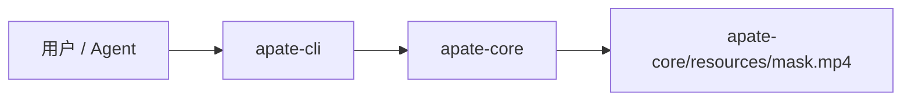
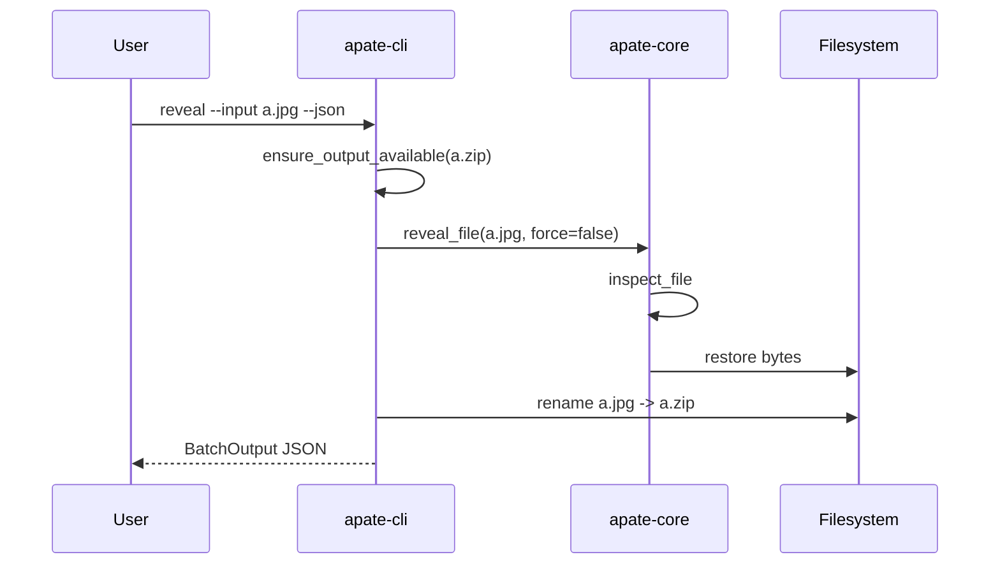

# Apate 架构说明

Apate 当前实现是一个 Rust workspace，用于提供文件格式伪装、还原、批量处理和自动化友好的 JSON 输出。它用于把文件外观伪装成图片、视频或可执行文件，以对抗网盘按扩展名、文件头或常见头尾签名做的限制；它会加密恢复元数据，但不是完整内容保密层。

## 顶层结构

```text
repo/
├── crates/
│   ├── apate-core/
│   │   ├── resources/mask.mp4
│   │   ├── src/lib.rs
│   │   └── tests/format_roundtrip.rs
│   └── apate-cli/
│       ├── src/main.rs
│       ├── src/gui.rs
│       └── tests/
├── docs/
├── skills/apate-cli/
└── .github/workflows/release.yml
```

## Crate 边界

- `apate-core`：负责字节级算法、面具定义、恢复元数据加密、输入文件收集和错误类型。
- `apate-cli`：负责 `clap` 参数解析、JSON 输出、Windows 拖拽 GUI、TUI 菜单、批量处理和重命名策略；Windows 交互环境无参数运行时进入 GUI，`apate tui` 显式进入终端菜单，子命令服务脚本和 agent。



## 文件格式

`disguise_file` 会就地改写目标文件：

```text
+---------+----------------------+------------------------------+
| 头部    | 中间 payload         | 尾部                         |
+---------+----------------------+------------------------------+
| mask    | 原文件中间字节       | 混淆尾部窗口 + 加密恢复元数据 |
+---------+----------------------+------------------------------+
```

- `mask`：写入文件头部，长度为面具字节数。
- `original_head`：原文件前 `min(file_len, mask.len())` 字节，写入 ChaCha20 加密元数据。
- `original_tail`：原文件最后最多 128 KiB 字节，伪装时原位混淆，并写入 ChaCha20 加密元数据。
- `ext`：原扩展名写入加密元数据，用于把 `secret.jpg` 还原为 `secret.zip`。
- `metadata`：包含原始文件长度、头窗口、尾窗口和原扩展名；尾部仍保留 4 字节 little-endian i32 面具长度用于定位。

`reveal_file` 根据尾部长度字段读取恢复元数据，截断附加内容，然后写回原始头窗口和尾窗口。中间 payload 不会被复制或重写，因此文件越大，处理时间也主要取决于 mask 长度、128 KiB 尾部窗口和元数据大小。

## 安全检查链

- `validate_mask` 拒绝空面具和超限面具。
- `inspect_file` 不只信任尾部长度字段，还要求文件头匹配内置面具或 `one_key_mask()`。
- `reveal_file(path, false)` 会先通过 `inspect_file`，未识别文件返回 `NotDisguised`。
- CLI 在写入前检查默认重命名目标是否存在，存在则返回 `output_exists`，避免覆盖用户文件。
- `--dry-run` 复用正式执行的 mask 校验和输出路径检查。

## CLI 流程

GUI 只负责窗口、菜单和拖拽入口，不保存独立文件格式逻辑。拖入中间区域时调用与 CLI 相同的 `disguise_file`、`disguise_output_path`、`ensure_output_available` 和 `rename_if_needed`；拖入右侧区域时调用与 CLI 相同的 `reveal_file`、`reveal_output_path` 和输出冲突检查。因此 GUI、TUI、CLI 的默认命名和安全行为保持一致。




## 发布与 CI

`.github/workflows/release.yml` 会：

- 在 `main` push 和 `v*` tag push 时构建 Windows/Linux 产物。
- 在 `main` push 时更新 `latest` 预发布 Release，并把构建附件放到 Releases 页面。
- 在 `v*` tag push 时创建正式 GitHub Release。
- 使用 `CHANGELOG.md` 的 `Unreleased` 段作为 Release Notes。
- 发布压缩包只包含对应平台的可执行文件，不把 `CHANGELOG.md` 打进附件目录。

本地发布前至少运行：

```powershell
cargo test --workspace
cargo build --release --locked -p apate-cli
```
