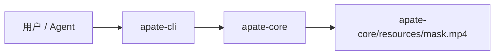
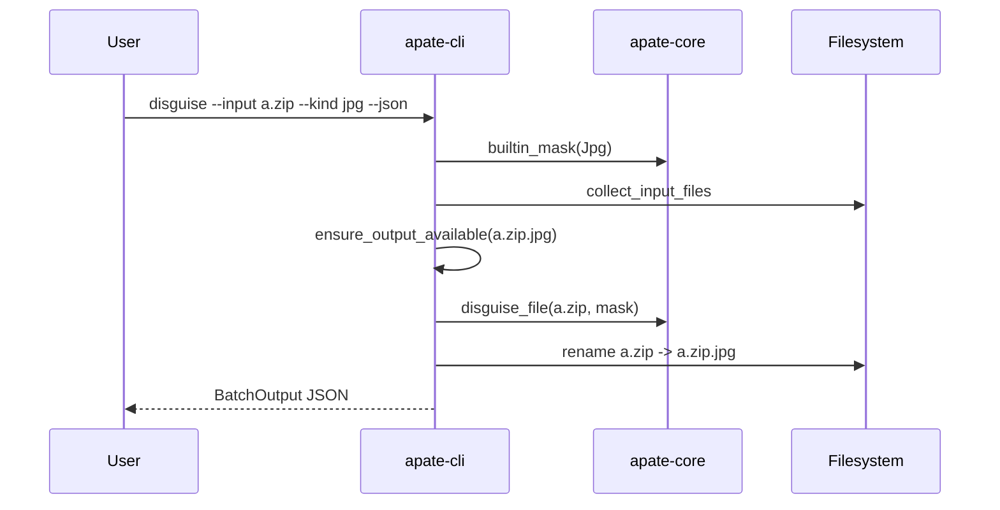
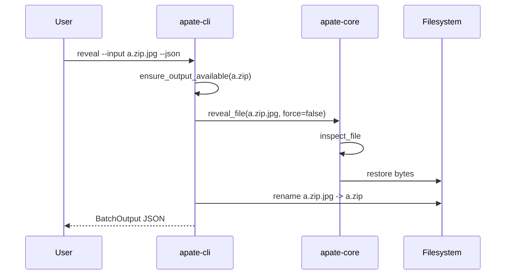

# Apate 架构说明

Apate 当前实现是一个 Rust workspace，用于提供文件格式伪装、还原、批量处理和自动化友好的 JSON 输出。

## 顶层结构

```text
repo/
├── crates/
│   ├── apate-core/
│   │   ├── resources/mask.mp4
│   │   ├── src/lib.rs
│   │   └── tests/format_roundtrip.rs
│   └── apate-cli/
│       ├── src/main.rs
│       └── tests/
├── docs/
├── skills/apate-cli/
└── .github/workflows/release.yml
```

## Crate 边界

- `apate-core`：只依赖 `std` 和 `thiserror`，负责字节级算法、面具定义、输入文件收集和错误类型。
- `apate-cli`：负责 `clap` 参数解析、JSON 输出、TUI 菜单、批量处理和重命名策略。



## 文件格式

`disguise_file` 会就地改写目标文件：

```text
+---------+----------------------+--------------------------+
| 头部    | 原文件剩余 payload   | 尾部附加                 |
+---------+----------------------+--------------------------+
| mask    | 原文件未覆盖字节     | rev(original_head) + len |
+---------+----------------------+--------------------------+
```

- `mask`：写入文件头部，长度为面具字节数。
- `original_head`：原文件前 `min(file_len, mask.len())` 字节。
- `rev(original_head)`：倒序保存到尾部，用于还原。
- `len`：4 字节 little-endian i32，记录面具长度。

`reveal_file` 根据尾部长度字段定位倒序保存的原文件头，截断尾部元数据，并把原文件头写回。

## 安全检查链

- `validate_mask` 拒绝空面具和超限面具。
- `inspect_file` 不只信任尾部长度字段，还要求文件头匹配内置面具或 `one_key_mask()`。
- `reveal_file(path, false)` 会先通过 `inspect_file`，未识别文件返回 `NotDisguised`。
- CLI 在写入前检查默认重命名目标是否存在，存在则返回 `output_exists`，避免覆盖用户文件。
- `--dry-run` 复用正式执行的 mask 校验和输出路径检查。

## CLI 流程





## 发布与 CI

`.github/workflows/release.yml` 会：

- 在 `main` push 和 `v*` tag push 时构建 Windows/Linux 产物。
- 在 `v*` tag push 时创建 GitHub Release。
- 使用 `CHANGELOG.md` 的 `Unreleased` 段作为 Release Notes。

本地发布前至少运行：

```powershell
cargo test --workspace
cargo build --release --locked -p apate-cli
```
