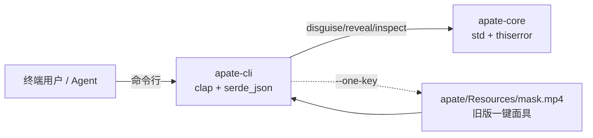
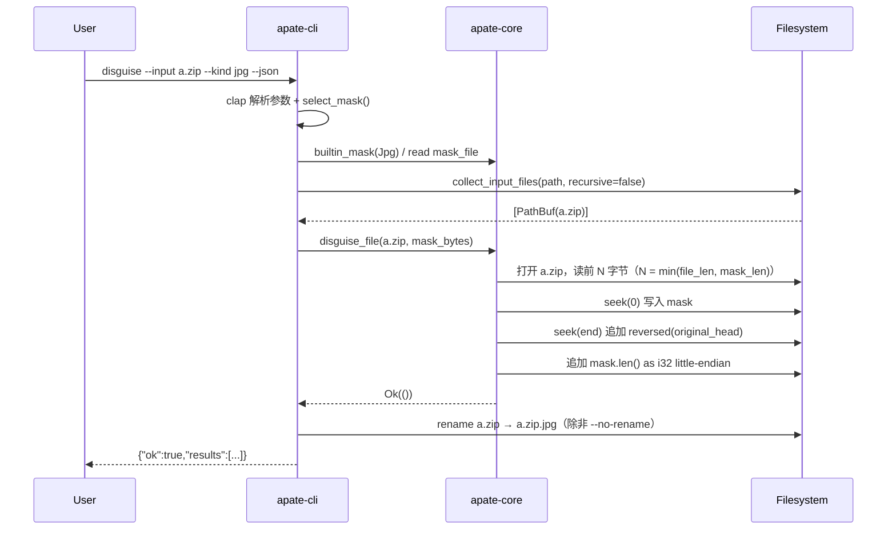
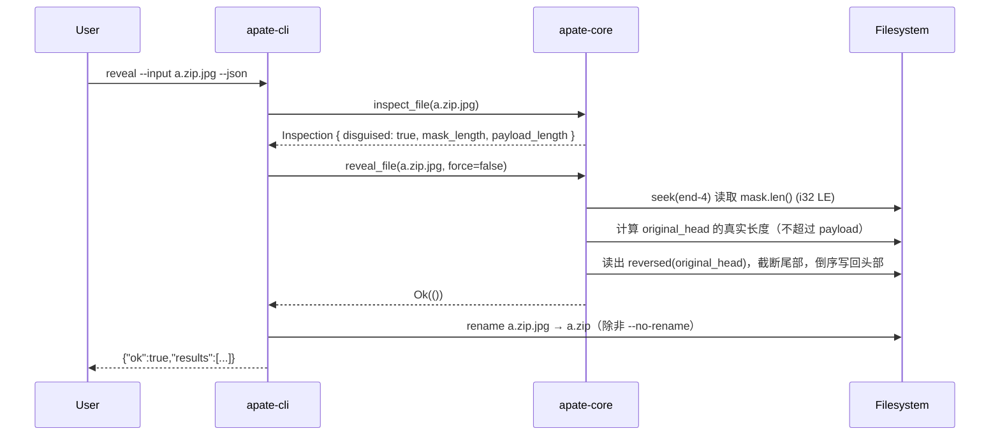

# Apate 架构说明

> 本仓库 `apate` 是一个用于「文件格式伪装」的工具：把任意二进制文件的字节级外观改写为另一
> 种格式（mp4 / jpg / exe / mov），从而绕过基于文件头的简单限制；并能 1:1 还原原始字节。
> 历史实现是 C#/WinForms（`apate/` 目录），当前迭代用 Rust 重构为 workspace，
> 并保持对旧版格式的字节级兼容。

## 顶层结构

```
apate/
├── apate/                         旧版 C#/WinForms 实现（保留作兼容与资源来源）
│   ├── ApateUI.cs                 WinForms 主界面
│   ├── Program.cs                 应用入口
│   └── Resources/
│       └── mask.mp4               一键伪装（one-key）使用的内置 mp4 面具
├── crates/
│   ├── apate-core/                Rust 核心库（纯算法，无 IO 框架依赖）
│   │   ├── src/lib.rs
│   │   └── tests/legacy_format.rs 旧格式字节级回归测试
│   └── apate-cli/                 Rust CLI（clap + serde_json）
│       ├── src/main.rs
│       └── tests/{cli,tui}.rs     集成测试
├── skills/
│   └── apate-cli/SKILL.md         面向 agent 的 CLI 使用说明
├── docs/                          本目录 —— 项目文档
└── .github/workflows/release.yml  v* tag → 多平台构建与 Release
```

## Crate 依赖图



依赖原则：

- `apate-core` 仅依赖 `thiserror` 与 `std`，刻意不引入 IO 框架，方便在其他宿主（GUI、
  Web、嵌入式脚本）里复用算法。
- `apate-cli` 是唯一的用户面二进制，承担 CLI 解析、JSON 序列化、TUI 菜单、批量 IO。

## 数据流：单文件 `disguise`



## 数据流：单文件 `reveal`



## 文件格式（旧版 apate 格式）

apate-core 写入的字节布局：

```
+---------+----------------------+-------------------+
| 头部    | 中部（原始 payload） | 尾部附加          |
+---------+----------------------+-------------------+
| mask    | 原文件剩余字节        | rev(orig_head) || |
| bytes   |                      | mask.len() (i32LE)|
+---------+----------------------+-------------------+
```

- **mask 头部**：覆盖原文件前 `min(mask.len, file_len)` 字节。
- **中部 payload**：原文件从 `min(mask.len, file_len)` 偏移起的剩余字节。
- **倒序原文件头**：长度等于 `min(mask.len, file_len)`，按字节反转。
- **4 字节 little-endian i32**：面具长度（mask length）。`reveal` 时把它当作有符号
  长度读取；非正数即判定为「非旧格式伪装文件」。

Rust 实现的兼容契约见 `crates/apate-core/tests/legacy_format.rs`：

```rust
disguise_file(&file, b"XYZ").unwrap();
// bytes[0..3]    == b"XYZ"           (mask 头)
// bytes[6..9]    == b"cba"           (倒序原文件头)
// bytes[9..13]   == 3_i32.to_le_bytes()
// bytes.len()    == 6 + 3 + 4
```

> 警告：不要在 `apate-core` 之外手写这个格式。旧版 C# 实现生成的伪装文件、
> Rust 生成的伪装文件、以及未来的实现都必须保持字节级一致；任何变动都需要同时
> 更新 `legacy_format.rs` 的回归测试。

## 错误模型

`apate-core::ApateError`（`thiserror` 派生）：

| 变体                              | CLI 中映射的 code            | 含义                          |
| --------------------------------- | ---------------------------- | ----------------------------- |
| `Io(io::Error)`                   | `io_error`                   | 文件系统读写错误              |
| `EmptyMask`                       | `empty_mask`                 | 面具字节为空                  |
| `MaskTooLarge { length, max }`    | `mask_too_large`             | 面具超过 `2_147_483_647 / 7`  |
| `NotDisguised`                    | `not_disguised`              | 长度字段不合法或文件长度不足  |
| `MissingPath(path)`               | `missing_path`               | 输入路径不存在                |
| `DirectoryRequiresRecursive(path)`| `directory_requires_recursive`| 输入是目录但未传 `--recursive` |

CLI 在批量模式下不短路 —— 单个文件失败只把对应 `results[i].ok` 标为 `false`，
顶层 `BatchOutput.ok` 是所有结果的 AND。

## CLI 子命令一览

| 子命令      | 用途                         | 关键 flag                              |
| ----------- | ---------------------------- | -------------------------------------- |
| `inspect`   | 判定文件是否为旧格式伪装文件 | `--json`                               |
| `masks`     | 列出内置面具                 | `--json`                               |
| `disguise`  | 伪装文件或目录               | `--one-key` / `--kind` / `--mask-file` |
| `reveal`    | 还原文件或目录               | `--force`                              |
| `tui`       | 交互菜单                     | （不支持 `--json`）                    |

完整参数与 JSON schema 见 [`docs/cli-reference.md`](./cli-reference.md)。

## TUI 流程

`apate tui` 是一个极简 stdin/stdout 菜单，进入后输入 1–4 选择具体操作，
随即退到一次性提示模式（一次性提示后回到 shell）。这不是一个常驻 TUI，
而是「分诊 + 直跳」的快捷入口。

```
apate TUI 模式
1) inspect
2) masks
3) disguise
4) reveal
0) exit
输入数字后回车
选择: ▌
```

## 发布与 CI

- GitHub Actions: `.github/workflows/release.yml` 在 `v*` tag 推送时构建
  Windows + Linux 产物。
- Release Notes 自动取 `CHANGELOG.md` 的 `Unreleased` 段。
- 本地发布前先跑 `cargo test --workspace`。

## 兼容与替换路线

- 旧版 WinForms UI 保留在 `apate/`，不做新功能开发；新功能请加在 `apate-core` / `apate-cli`。
- 一键伪装（`--one-key`）依然依赖 `apate/Resources/mask.mp4`：这是出于与旧版
  完全一致体验的考虑，未来若要解除此依赖，需要单独设计迁移路径。